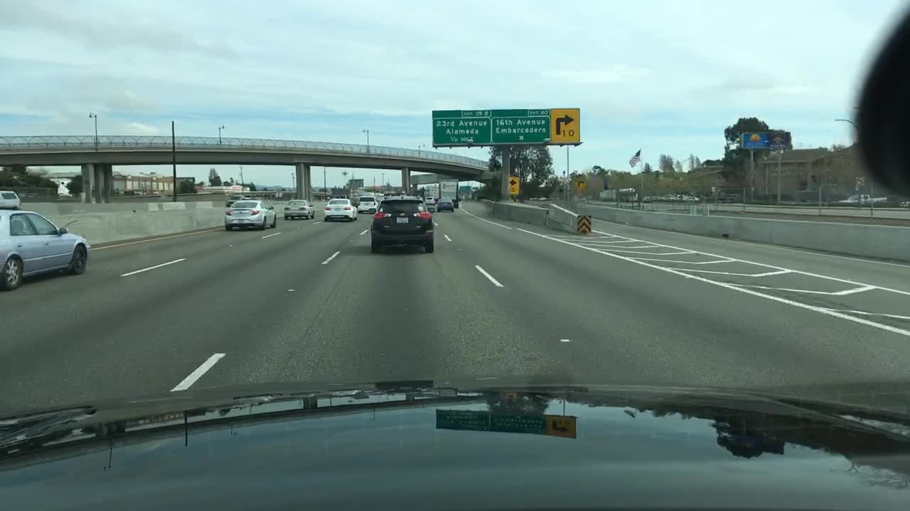
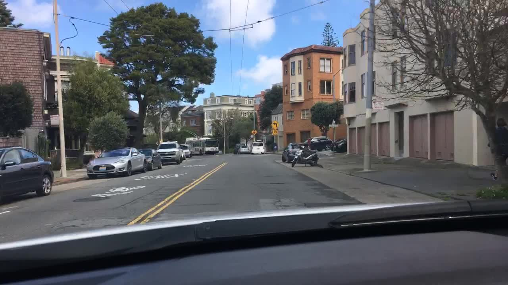
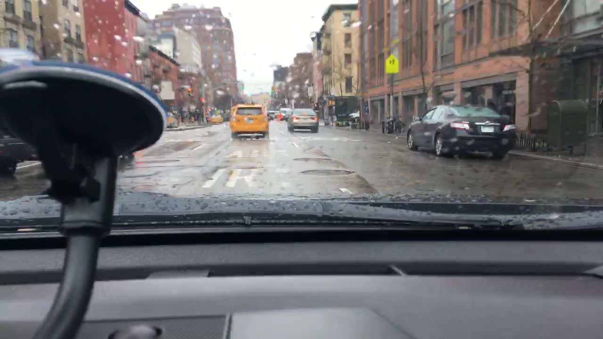
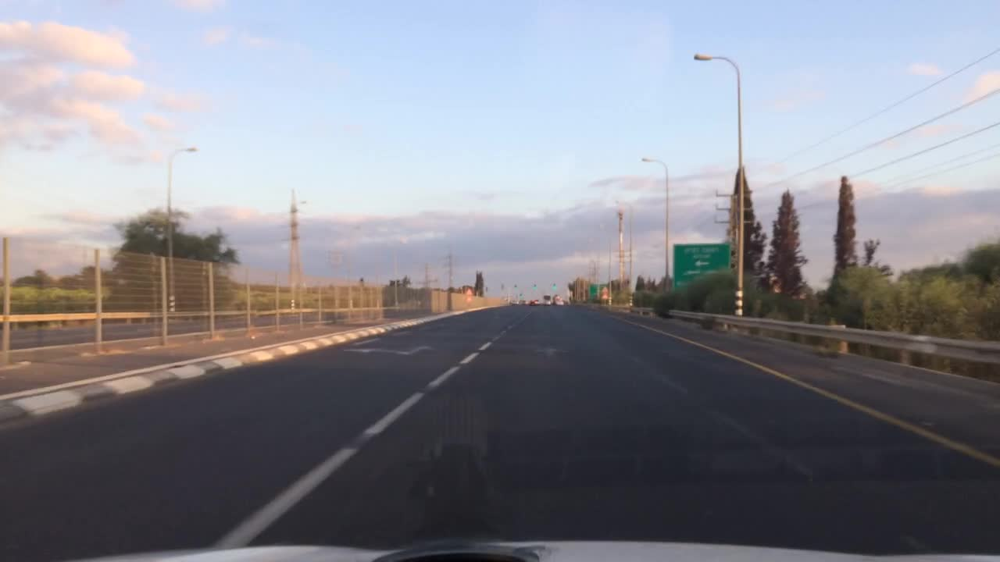

# Annotation guideline — Phân vùng Drivable Area

**Version:** v2

Bạn chỉ cần file này và task CVAT để làm việc. Rule nào không có trong file này thì không tồn tại. Gặp tình huống file
này không trả lời được thì làm theo mục 7, **đừng đoán ý tác giả**.

## 1. Objective + scope

- **Mục tiêu:** vẽ polygon vùng mặt đường **còn trống** mà xe ego (xe gắn camera) **được phép và có thể chạy tới ngay**
  trên ảnh dashcam BDD100K. Dữ liệu dùng để train model segmentation cho module **path planning**. Planner chỉ sinh quỹ
  đạo bên trong vùng bạn vẽ.
- **Nguyên tắc an toàn:** vẽ vùng không được chạy thành drivable (false positive) là lỗi **critical**, vì planner có thể
  lái xe vào đó. Vẽ đè lên xe khác cũng là false positive. Bỏ sót một phần mặt đường chỉ là lỗi major/minor. **Khi phân
  vân giữa "vẽ" và "không vẽ" drivable, chọn không vẽ.**
- **Trong scope:**
  - mặt đường nhựa/bê tông còn trống của làn ego;
  - các làn **cùng chiều** liền kề;
  - làn khẩn cấp đủ điều kiện ở mục 5;
  - đoạn đi thẳng qua vạch qua đường và giao lộ phía trước.
- **Ngoài scope:** mọi thứ khác. Mục 5 phân loại vùng nào dùng `ignore_region`, vùng nào để trống.

## 2. Annotation unit

- Đơn vị: **một ảnh tĩnh**. Mỗi ảnh gán nhãn độc lập, không dựa vào ảnh khác.
- Mỗi **làn** là **một polygon riêng**:
  - đúng **1** polygon `drivable_direct` cho làn ego (0 polygon nếu không xác định được làn ego, xem mục 7);
  - **1 polygon `drivable_alternative` cho mỗi làn cùng chiều** (kể cả làn khẩn cấp). Hai làn cùng chiều là 2 polygon,
    không gộp;
  - mỗi vùng `ignore_region` liền mạch là 1 polygon. Ví dụ: làn ngược chiều là 1 polygon, làn đỗ xe bên phải là 1
    polygon khác.
- Label chỉ có class, **không có attribute** để chọn.

## 3. Geometry rule

- **Tool:** Polygon (Shape, không dùng Track). Không dùng mask, box hay polyline.
- **Tolerance:** mép polygon lệch so với ranh giới thật **≤ 5 px** ở nửa dưới ảnh (y ≥ 360) và **≤ 10 px** ở nửa trên
  (gần điểm tụ). Zoom ≥ 200% khi đặt điểm ở vùng xa hoặc quanh viền xe.
- **Ranh giới giữa hai làn:**
  - Vạch **đứt** giữa hai làn drivable: ranh giới đặt ở **tâm vạch**. Hai polygon dùng chung cạnh, không chồng lên
    nhau, không để hở.
  - Vạch **liền** (trắng hoặc vàng) ở rìa vùng drivable: drivable dừng ở **mép trong** của vạch (phía ego). Vạch thuộc
    về vùng bên kia.
  - Không có vạch (đường khu dân cư, vạch mờ): nối dài đoạn vạch còn thấy được. Nếu không thấy đoạn nào thì dùng mép bó
    vỉa hoặc mép xe đỗ (mục 5).
- **Cạnh đáy:** bám theo **viền trên của nắp capo hoặc táp-lô** xe ego. Không vẽ lên capo, táp-lô hay hình phản chiếu
  trên capo. Không thấy capo thì cạnh đáy là đáy ảnh.
- **Giới hạn xa:** polygon dừng ở hàng ngang **đầu tiên** thỏa một trong bốn điều kiện:
  1. gặp **xe / người / vật cản** chiếm ≥ 1/2 bề ngang làn (mục 6);
  2. làn hẹp dưới khoảng **20 px** chiều ngang;
  3. mặt đường bị vật cố định chắn ngang (đỉnh dốc, khúc cua khuất sau nhà/cây);
  4. đường chân trời / điểm tụ.

  Không bao giờ vẽ vượt đường chân trời.
- **Không vẽ đè lên xe:** chi tiết ở mục 6. Không pixel nào của xe, người hay vật cản được nằm trong polygon
  `drivable_direct` / `drivable_alternative`.
- **Phản chiếu, vệt chói, giọt mưa hoặc sticker trên kính chắn gió** đè lên mặt đường: bỏ qua và vẽ mặt đường bên dưới
  như bình thường. Đây không phải vật cản.
- **Vật đặc bên trong xe ego** che mặt đường (giá đỡ điện thoại, camera hành trình, gương chiếu hậu): coi như táp-lô.
  Polygon khoét theo viền vật đó, không vẽ lên nó.
- **Bóng râm** trên mặt đường không phải ranh giới. Chỉ vạch sơn, bó vỉa, mép mặt nhựa hoặc chân xe mới là ranh giới.
- **Mật độ điểm:** thêm điểm tại mọi chỗ mép đổi hướng. Trên đoạn mép cong, hai điểm liên tiếp cách nhau không quá khoảng
  100 px. Viền xe cần ít nhất 4 điểm (góc trái, lốp trái, lốp phải, góc phải).

## 4. Taxonomy

| Label | Loại CVAT | Khi nào dùng |
|---|---|---|
| `drivable_direct` | polygon | Phần **còn trống** của làn ego, nối dài thẳng qua vạch qua đường và giao lộ phía trước |
| `drivable_alternative` | polygon | Phần còn trống của mỗi làn **cùng chiều** nằm cạnh làn ego (hoặc cạnh một làn alternative khác). Làn chỉ rẽ (có mũi tên) vẫn tính. Làn khẩn cấp đủ điều kiện ở mục 5 cũng tính |
| `ignore_region` | polygon | Vùng **nằm trong lòng đường, liền mặt nhựa, trông như đường chạy nhưng ego không được chạy** (danh sách ở mục 5) |

Không có attribute và không có tag. Mọi quyết định thể hiện bằng **có hoặc không có polygon, và polygon thuộc class
nào**.

## 5. Inclusion / exclusion

Với mỗi vùng mặt đất trong ảnh, trả lời theo thứ tự và dừng ở câu đầu tiên đúng:

1. **Là làn ego** còn trống (kể cả đoạn nối dài qua giao lộ, vạch qua đường)? → `drivable_direct`.
2. **Là làn cùng chiều** nằm cạnh làn ego, chỉ ngăn bởi vạch trắng (đứt hoặc liền đơn)? → `drivable_alternative`.
3. **Là làn khẩn cấp (hard shoulder)** thỏa **đủ 3 điều kiện**? → `drivable_alternative`:
   - (a) mặt nhựa/bê tông liền với làn chạy cùng chiều, chỉ ngăn bởi vạch sơn;
   - (b) tại hàng ngang ngay trên cạnh đáy polygon, **rộng ≥ bề ngang một xe con**. So với xe gần nhất trên ảnh, hoặc
     coi là ≥ 2/3 bề ngang làn ego;
   - (c) không có vật cản cố định (cọc, rào, thùng rác) trên đoạn đó.

   Lề không đạt đủ (a), (b), (c) → câu 5 (để trống).
4. **Nằm trong lòng đường** (giữa hai bó vỉa, cùng mặt nhựa liền với làn chạy) **nhưng ego không được chạy**? →
   `ignore_region`. Gồm:
   - **làn ngược chiều**: bên kia vạch vàng giữa đường (đơn, đôi, đứt hay liền đều tính);
   - **làn đỗ xe** dọc lề, có xe đỗ hay trống;
   - **làn xe đạp**: làn hẹp giữa hai vạch trắng liền, thường nằm giữa làn chạy và làn đỗ;
   - **vùng gạch chéo / chevron / gore area** (trắng hoặc vàng), và **làn cùng chiều nằm bên kia vùng gạch chéo**, ví dụ
     nhánh ra cao tốc đã tách.
5. **Còn lại → để trống, không vẽ gì.** Gồm:
   - lề hẹp hoặc lề không đạt câu 3; vỉa hè (có bó vỉa), bãi cỏ, sỏi, đất, tường, rào;
   - bãi xe, sân trạm xăng, lối vào nhà nằm **sau đường bó vỉa kéo dài**. Chỗ bó vỉa hạ thấp vẫn tính theo đường bó
     vỉa kéo dài;
   - lòng đường bên kia **dải phân cách cứng** (bê tông, rào, dải cỏ): đó là đường khác, không phải `ignore_region`;
   - phần **đường ngang** trong giao lộ (cross street) nằm ngoài phần nối dài của các làn đã vẽ;
   - xe, người, vật cản trên làn drivable (mục 6); capo, táp-lô, bầu trời, nhà cửa.

**Làn đỗ xe không có vạch:** ranh giới giữa làn chạy và làn đỗ là đường thẳng nối **mép trong** (phía lòng đường) của
các xe đang đỗ. Đoạn không có xe đỗ thì nối dài đường đó. Không có xe đỗ nào và không có vạch thì làn chạy kéo tới bó
vỉa.

**`ignore_region` được phép trùm qua xe đỗ** trong làn đỗ và xe chạy trong làn ngược chiều. Đây là vùng cấm, trùm qua xe
không tạo false positive, và làm vậy tránh phải cắt hàng chục mảnh nhỏ. Rule "không đè lên xe" ở mục 6 chỉ áp dụng cho
hai label drivable.

## 6. Visibility / occlusion

**Rule chính: polygon drivable không bao giờ vẽ đè lên xe, người hay vật cản.** Phần mặt đường bị che không được suy
luận, không được nối qua.

| Tình huống | Cách vẽ |
|---|---|
| Xe **nằm trong làn**, chiếm ≥ 1/2 bề ngang làn tại vị trí đó (thường là xe phía trước) | Polygon của làn đó **dừng tại chân xe**: cạnh trên của polygon chạy dọc theo đường tiếp xúc lốp sau / cản sau với mặt đường, kéo sang hai vạch làn. **Không vẽ phần làn phía sau xe (xa hơn xe)**, kể cả khi thấy mặt đường hai bên xe |
| Xe **lấn một phần** vào làn, chiếm < 1/2 bề ngang làn (xe đang chuyển làn, xe đỗ lấn ra) | **Khoét theo viền xe:** mép polygon đi vòng theo chân và thân xe ở phần xe lấn vào, rồi tiếp tục lên tới giới hạn xa ở phần làn còn trống |
| Người đi bộ, xe đạp, cọc tiêu trong làn | Như xe: ≥ 1/2 bề ngang làn thì dừng tại chân; < 1/2 thì khoét viền |
| Chân xe bị bóng tối che, không thấy lốp | Đặt cạnh tại **mép dưới cùng nhìn thấy được** của thân xe (cản sau) |

- CVAT polygon không có lỗ (hole). Vì vậy không bao giờ có trường hợp xe nằm lọt giữa polygon: hoặc polygon dừng ở chân
  xe, hoặc khoét từ mép vào.
- **Thời tiết / ánh sáng làm mờ mép** (tuyết, đêm, mưa, mặt đường ướt chói): nếu vẫn xác định được làn ego (thấy vạch
  từng đoạn, vệt bánh xe trên tuyết, đèn hậu xe phía trước) thì vẽ polygon **co vào trong**. Chỉ lấy phần chắc chắn là
  mặt đường, không nới ra.

## 7. Ambiguity handling

Task **không có tag escalate**. Mọi trường hợp không chắc chắn xử lý bằng nguyên tắc an toàn: **vùng nghi ngờ không vẽ
drivable**.

| Quyết định | Thể hiện trong CVAT export |
|---|---|
| **LABEL** | polygon `drivable_direct` / `drivable_alternative` |
| **IGNORE** | polygon `ignore_region` (vùng trong lòng đường, cấm chạy). Vùng ngoài lòng đường thì để trống |
| **UNKNOWN** (không chắc vùng có chạy được không) | **Không có polygon drivable** ở vùng đó |
| **Không xác định được làn ego** | **Ảnh không có polygon drivable nào** |

Áp dụng cụ thể:

1. **Không xác định được làn ego nằm ở đâu** (không thấy vạch, vệt bánh xe hay mép đường, ví dụ tuyết phủ kín): không
   vẽ polygon drivable nào. Vẫn vẽ `ignore_region` nếu nhận ra chắc chắn vùng cấm.
2. **Làn kế bên không rõ cùng chiều hay ngược chiều** (không thấy vạch vàng, không thấy xe hay hướng đầu xe): không vẽ
   drivable cho làn đó. Nó vẫn nằm trong lòng đường nên vẽ `ignore_region`.
3. **Vật cản bất thường** trong lòng đường (đống tuyết, công trường, xe hỏng): xử lý như xe ở mục 6. Không vẽ drivable
   đè lên hoặc vượt qua nó.
4. **Không chắc lề có đạt điều kiện làn khẩn cấp** (mục 5, câu 3): để trống.
5. **Vùng không khớp câu nào ở mục 5**: để trống.

## 8. Temporal rule

Không áp dụng: task gồm ảnh tĩnh độc lập, dùng Shape, không dùng Track, không nhìn ảnh trước/sau.

## 9. Examples

| sample_id | Ảnh | Thấy gì | Expected output | Rule |
|---|---|---|---|---|
| BDD01 |  | Cao tốc nhiều làn cùng chiều, vạch đứt trắng. SUV đen ngay phía trước giữa làn ego. Bên phải có vạch trắng liền, sau đó là vùng gạch chéo trắng tách nhánh ra. Capo đen có phản chiếu biển báo | `drivable_direct` từ viền capo tới **chân SUV đen** thì dừng; 1 `drivable_alternative` cho **mỗi** làn cùng chiều trái/phải tới vạch trắng liền, mỗi làn dừng ở chân xe đầu tiên trong làn (xe bạc bên trái) hoặc giới hạn xa; 1 `ignore_region` phủ vùng gạch chéo **và** nhánh ra phía bên kia | 3, 5 (câu 4), 6 |
| BDD02 |  | Phố đô thị nhiều làn, xe ego đứng trước vạch dừng, phía trước là vạch qua đường rồi giao lộ. Taxi vàng ở làn trái, xe bus ở phía xa bên trái | `drivable_direct` đi **thẳng qua** vạch dừng, vạch qua đường và giao lộ, dừng ở chân xe đầu tiên trong làn ego; `drivable_alternative` làn trái dừng tại **chân taxi**; `drivable_alternative` làn phải; đường ngang trong giao lộ để trống | 5 (câu 1, 5), 6 |
| BDD03 |  | Cao tốc: vạch vàng liền bên trái làn ego, bên kia là dải nhựa hẹp, cỏ, rào và chiều ngược lại. Xe xám giữa làn ego | `drivable_direct` từ mép trong vạch vàng tới tâm vạch đứt bên phải, dừng tại **chân xe xám**; `drivable_alternative` làn phải; dải nhựa ngoài vạch vàng hẹp hơn một xe nên để trống; cỏ và đường bên kia rào để trống | 3, 5 (câu 3b, 5), 6 |
| BDD04 |  | Đường dân cư hai chiều, vạch vàng đôi, không có vạch mép. Xe đỗ hai bên, xe máy đỗ sát lề phải, lối vào garage. Không thấy capo, chỉ thấy táp-lô | `drivable_direct` từ mép phải vạch vàng đôi tới đường nối mép trong các xe đỗ bên phải, lên tới giới hạn xa; `ignore_region` cho làn ngược chiều bên trái vạch vàng đôi (trùm qua xe đỗ bên trái); `ignore_region` dải đỗ xe bên phải; vỉa hè và garage để trống; cạnh đáy theo viền táp-lô | 5 (câu 4, làn đỗ không vạch) |
| BDD17 |  | Đường phố trời mưa, kính chắn gió có giọt nước và giá đỡ điện thoại gắn trên táp-lô. Taxi vàng phía trước trong làn ego, xe đen đỗ sát lề phải | `drivable_direct` từ viền táp-lô tới **chân taxi vàng** thì dừng; khoét viền tránh giác hút giá đỡ điện thoại; `ignore_region` cho làn đỗ xe sát lề phải; giọt mưa trên kính không coi là vật cản | 3, 5 (câu 4), 6 |
| BDD22 |  | Cao tốc lúc chạng vạng ngược sáng, vạch đứt trắng giữa hai làn. Bên trái có bó vỉa dải phân cách sơn đen-trắng; bên phải có vạch vàng liền và hộ lan | `drivable_direct` cho làn ego; `drivable_alternative` cho làn chạy bên cạnh ngăn bởi vạch đứt trắng; dải lề ngoài vạch vàng liền và hộ lan bên phải để trống (không vẽ `ignore_region`) | 3, 5 (câu 5) |

## 10. Common mistakes

1. **[CRITICAL] Vẽ drivable vào vùng cấm:** vùng gạch chéo, làn đỗ xe, làn xe đạp, lề hẹp, làn ngược chiều. **Cách
   tránh:** với mỗi polygon drivable, đi lại cây quyết định ở mục 5.
2. **[CRITICAL] Vẽ trùm qua vạch vàng:** gộp làn ngược chiều vào `drivable_direct` trên đường không có dải phân cách.
   **Cách tránh:** vạch vàng giữa đường luôn là ranh giới cứng, dù vạch đứt hay liền.
3. **[CRITICAL] Vẽ drivable đè lên xe, hoặc nối polygon qua xe để lấy phần đường phía sau.** **Cách tránh:** xe chiếm
   ≥ 1/2 làn thì dừng tại chân xe; < 1/2 thì khoét viền (mục 6).
4. **Dừng polygon trên thân xe thay vì tại chân xe:** cạnh trên đặt ở cửa kính sau hoặc đèn hậu. **Cách tránh:** cạnh
   trên là đường tiếp xúc lốp / cản sau với mặt đường.
5. **Gắn nhãn mọi lề thành làn khẩn cấp.** **Cách tránh:** kiểm đủ 3 điều kiện (a), (b), (c) ở mục 5 câu 3; không chắc
   thì để trống.
6. **Dùng `ignore_region` sai chỗ:** vẽ lên vỉa hè, cỏ, bãi xe hoặc đường bên kia dải phân cách cứng. **Cách tránh:**
   `ignore_region` chỉ dùng **trong lòng đường** (mục 5, câu 4).
7. **Vẽ lên capo, táp-lô hoặc phản chiếu trên capo.** **Cách tránh:** zoom mép dưới ảnh, bám viền trên capo.
8. **Gộp nhiều làn cùng chiều vào 1 polygon `drivable_alternative`.** **Cách tránh:** mỗi làn là 1 polygon (mục 2).
9. **Nới polygon ra khi thời tiết xấu.** **Cách tránh:** co vào trong; không chắc làn ego ở đâu thì không vẽ drivable
   (mục 7).
10. **Theo mép bóng râm** thay vì vạch sơn hoặc bó vỉa. **Cách tránh:** bóng râm không phải ranh giới.
